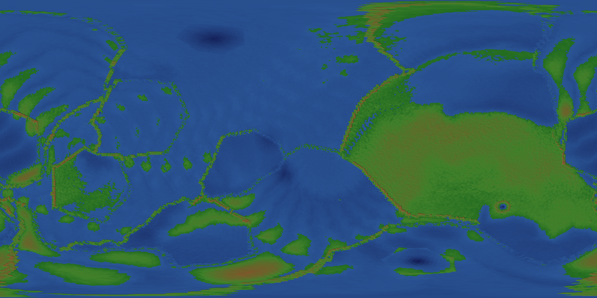
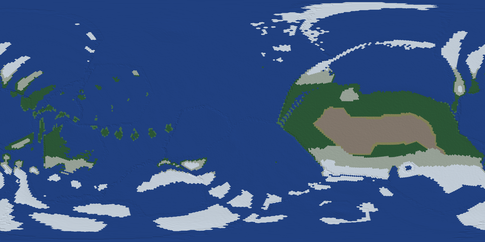
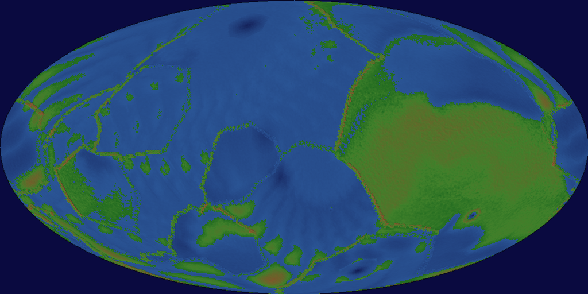
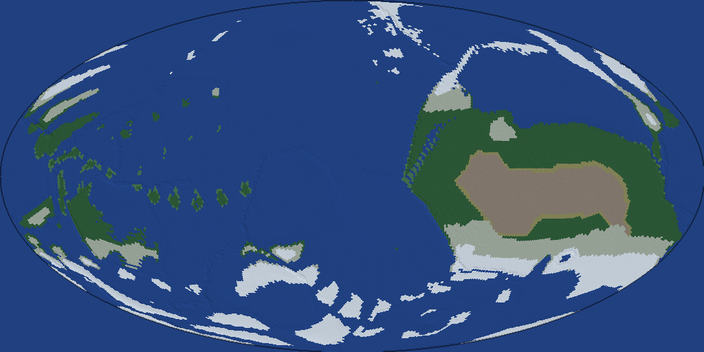
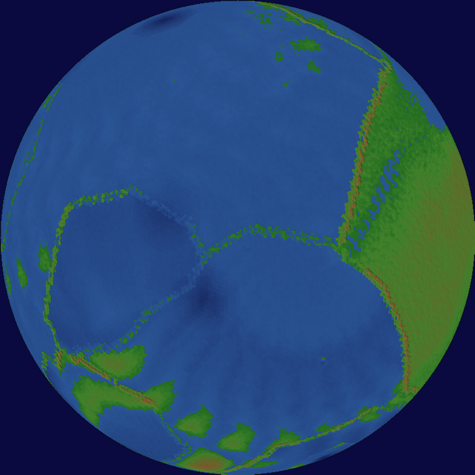
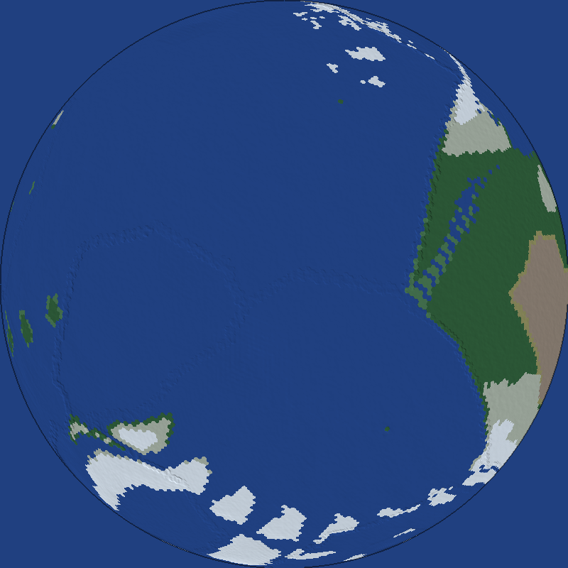

# 🕯️ The Dark Candle

**A data-driven voxel game with real-world physics, procedural planetary generation, and emergent chemistry.**

Built with [Bevy 0.18](https://bevyengine.org/) · Rust 2024 Edition · MIT / Apache-2.0

---

## World Generation

The Dark Candle generates entire planets from a single seed — geodesic grids,
tectonic plates, impact craters, biomes, geology, and ore deposits — then
renders them as interactive 3D globes or 2D map projections with GPU-accelerated
terrain detail.

<p align="center">
  
  <br/>
  <em>Equirectangular elevation map with hillshading (seed 42, level 6 — 40 962 cells)</em>
</p>

<p align="center">
  
  <br/>
  <em>Biome distribution — 14 climate types from tundra to tropical rainforest</em>
</p>

<p align="center">
  
  
  <br/>
  <em>Mollweide equal-area projections — elevation (left) and biome (right)</em>
</p>

<p align="center">
  
  
  <br/>
  <em>Orthographic views</em>
</p>

---

## Features

### 🌍 Planetary Generation
- **Geodesic grid** — icosahedral subdivision (configurable level 0–8, up to 655 362 cells)
- **Tectonic simulation** — power-law plate sizes, configurable geological time (Quick/Normal/Extended modes), physical plate velocities (2–10 cm/yr SI), subduction deformation, mountain building
- **Tectonic time-lapse** — step-by-step playback of plate evolution with play/pause, speed control (0.25×–32×), and frame stepping
- **Impact events** — asteroid craters with ejecta blankets and central peaks
- **Celestial system** — procedural star, moons, rings, and orbital mechanics
- **Climate model** — Stefan-Boltzmann energy balance, latitude gradients, altitude lapse rates, ocean proximity
- **14 biome types** — Whittaker classification from temperature and precipitation
- **10 rock types & 7 ore types** — geological age, metamorphism, and hydrothermal deposits
- **GPU-accelerated rendering** — WGSL compute shaders for terrain projection (35× speedup at 4K)
- **Map projections** — equirectangular, Mollweide, orthographic with hillshading
- **Interactive 3D globe** — Bevy renderer with orbital camera, colour modes, and tectonic time-lapse playback

### 🧱 Voxel World
- **Octree chunks** — 32³ base resolution with adaptive multi-resolution subdivision
- **20 material types** — loaded from RON data files (stone, water, iron, lava, wood, glass…)
- **Procedural terrain** — noise-based heightmaps, valley/river carving, hydraulic erosion
- **Tree generation** — L-system-inspired procedural trees with bark, wood, twig, and leaf materials
- **Scene presets** — valley river, volcanic island, ocean, flat terrain, and more

### ⚗️ Physics & Chemistry
- **SI units throughout** — 1 voxel = 1 metre, real densities, conductivities, specific heats
- **Heat diffusion** — Fourier's law with thermal conductivity per material
- **Phase transitions** — melting, freezing, boiling, condensation with latent heat
- **Chemical reactions** — combustion, oxidation, thermite, oxyhydrogen — loaded from RON
- **Fire propagation** — temperature-driven ignition with fuel consumption and ash production
- **Radiation** — Stefan-Boltzmann thermal emission and incandescence

### 🌊 Fluid Dynamics
- **Three simulation models:**
  - Adaptive Mesh Refinement Navier-Stokes
  - Lattice Boltzmann Method (D3Q19)
  - FLIP/PIC hybrid particle-grid
- **Viscosity, surface tension, and buoyancy** from real material properties

### 🌤️ Atmosphere & Weather
- **Rayleigh & Mie scattering** — physically-based sky colours
- **Day/night cycle** — orbital sun position with twilight transitions
- **Volumetric clouds** — 3D noise density with GPU ray marching
- **Weather particles** — rain, snow, and sand with wind advection from LBM field
- **Valley fog** — temperature-inversion fog accumulation in low terrain
- **Cloud shadows** — projected onto terrain from cloud layer

### 💡 Lighting & Optics
- **Sunlight** — directional from orbital position with seasonal variation
- **Ambient occlusion** — voxel-space AO for chunk meshes
- **Thermal glow** — incandescent materials emit light based on temperature
- **Refraction & absorption** — wavelength-dependent light transport through materials

### 🦎 Creatures & AI
- **Biology system** — metabolism, body temperature, hydration, energy
- **Behaviour tree** — seek food, flee threats, idle, wander
- **Social system** — faction membership and relationship tracking
- **Pathfinding** — A* on voxel grid with movement cost per material
- **Food sources** — forageable resources with regrowth timers

### 🎮 Game Systems
- **Save/load** — 4 save slots (1 autosave + 3 manual) in RON format
- **First-person camera** — WASD + mouse look with configurable sensitivity
- **HUD** — health, temperature, coordinates, diagnostics overlay
- **Hotbar** — material selection for placement
- **Interaction** — voxel placement and removal via raycast

### 🖥️ GPU Compute
- **Headless wgpu pipelines** — no window required for rendering
- **Atmosphere renderer** — sky dome via compute shader
- **Terrain projection** — two-pass elevation + hillshade compute shader
- **Particle system** — GPU-driven particle simulation

---

## Quick Start

### Requirements
- Rust 1.85+ (edition 2024)
- Linux: Wayland or X11 display server
- GPU: Vulkan-capable (for compute shaders and rendering)

### Build & Run

```bash
# Run the game
cargo run --features bevy/dynamic_linking

# Run with release optimisations
cargo run --release
```

### Generate a Planet

```bash
# Generate a planet and print statistics
cargo run --bin worldgen -- --seed 42 --level 6 --stats

# Use a specific tectonic mode and geological age
cargo run --bin worldgen -- --seed 42 --level 6 --tectonic-mode extended --tectonic-age 4.5 --stats

# Export an elevation map
cargo run --release --bin worldgen -- \
  --seed 42 --level 6 \
  --projection equirect --colourmode elevation \
  --width 2048 --output world_elevation.png --gpu

# Export a biome map (Mollweide projection)
cargo run --release --bin worldgen -- \
  --seed 42 --level 6 \
  --projection mollweide --colourmode biome \
  --width 2048 --output world_biome.png --gpu

# Launch the interactive 3D globe viewer
cargo run --release --bin worldgen -- --seed 42 --level 6 --globe

# Launch the globe with tectonic time-lapse playback
cargo run --release --bin worldgen -- --seed 42 --level 6 --globe --timelapse

# Generate a rotating globe animation
cargo run --release --bin worldgen -- \
  --seed 42 --level 6 --animate --width 1024 --gpu
```

**Colour modes:** `elevation`, `biome`, `plate`, `geology`, `age`, `crust_depth`, `tidal`

**Projections:** `equirect`, `mollweide`, `orthographic`

**Tectonic modes:** `quick` (50 steps, ~0.2s), `normal` (200 steps, ~0.8s), `extended` (600 steps, ~2.4s) at level 7

### Run Tests

```bash
cargo test --lib                 # 1296 unit tests
cargo test --test simulations    # Physics simulation scenarios
cargo test --test validate_assets  # Asset loading validation
```

---

## Architecture

The codebase is organised into focused ECS modules:

| Module | Description |
|--------|-------------|
| `world/` | Octree chunks, meshing, terrain generation, raycasting, erosion |
| `physics/` | Rigid bodies, gravity, collision, LBM gas, FLIP fluid, atmosphere |
| `chemistry/` | Heat transfer, reactions, state transitions, radiation |
| `planet/` | Geodesic grid, tectonics, impacts, celestial, biomes, geology, rendering |
| `lighting/` | Sun cycle, sky scattering, light maps, volumetric clouds, fog |
| `weather/` | Particle emitters, wind advection, snow/rain accumulation |
| `biology/` | Metabolism, body temperature, hydration, energy systems |
| `behavior/` | Behaviour trees, AI decision-making |
| `social/` | Factions, relationships |
| `entities/` | Creatures, items, spawning |
| `procgen/` | Tree generation, biome decoration |
| `gpu/` | Headless wgpu compute pipelines (atmosphere, terrain, particles) |
| `data/` | RON asset loading for materials, reactions, configs |
| `persistence/` | Save/load system |
| `diagnostics/` | ECS dump, screenshots, video encoding, visualisation |
| `simulation/` | Headless tick-based simulation runner for tests |
| `camera/` | First-person camera controller |

**146 source files · ~60K lines of Rust · 1296+ tests**

### Data-Driven Design

Game data lives in `assets/data/` as RON files:
- **19 materials** — density, thermal conductivity, specific heat, hardness, viscosity, optical properties
- **8 chemical reactions** — reactants, products, activation energy, enthalpy
- **1 tree species** — L-system parameters for procedural generation
- **Configs** — atmosphere, fluid, planet, subdivision, universal constants

All physical constants use SI units. No magic numbers — emergent behaviour
arises from the interaction of real material properties and fundamental forces.

---

## Documentation

Detailed design documents live in [`docs/`](docs/):

- [Architecture Overview](docs/architecture.md)
- [Terrain Generation](docs/terrain-generation.md)
- [Geodesic Terrain Design](docs/geodesic-terrain-design.md)
- [Spherical Terrain](docs/spherical-terrain.md)
- [Fluid Simulation](docs/fluid-simulation-system.md)
- [Atmosphere Simulation](docs/atmosphere-simulation.md)
- [Advanced Physics](docs/advanced-physics.md)
- [Optics & Light](docs/optics-light.md)
- [Simulation Test System](docs/simulation-test-system.md)
- [Roadmap](docs/ROADMAP.md)

---

## Project Status

The Dark Candle is in active early development. The planetary generation
pipeline is functional and produces visually compelling worlds. The voxel engine,
physics, and chemistry systems are tested and working at the simulation level.

Current focus areas:
- Connecting planetary generation to the in-game voxel world
- Expanding the creature AI and ecology systems
- Performance optimisation for real-time gameplay

---

## License

Dual-licensed under [MIT](LICENSE-MIT) or [Apache-2.0](LICENSE-APACHE) at your option.
